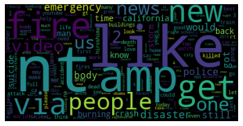
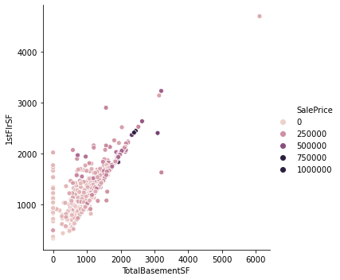

# Jacob Voyles Portfolio

## Project 1

### Real or Fake Tweets

Twitter has become an important communication channel in times of emergency.
The ubiquitousness of smartphones enables people to announce an emergency they’re observing in real-time. Because of this, more agencies are interested in programatically monitoring Twitter (i.e. disaster relief organizations and news agencies).

This Project aims to detect real emergencies from tweets based on key words and hashtags.

Link to project [Github](https://github.com/jtvkw2/Tweet-Sentiment-Analysis)
Link to project [Kaggle](https://www.kaggle.com/jacobvoyles/real-or-fake-tweet-machine-learning)

## Project 2

### Housing Price Analysis

With 79 explanatory variables describing (almost) every aspect of residential homes in Ames, Iowa, I used this dataset to predict the final price of each home.

Link to project [Github](https://github.com/jtvkw2/House-Price-Analysis)
Link to project [Kaggle](https://www.kaggle.com/jacobvoyles/house-prices-analysis)
